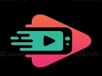
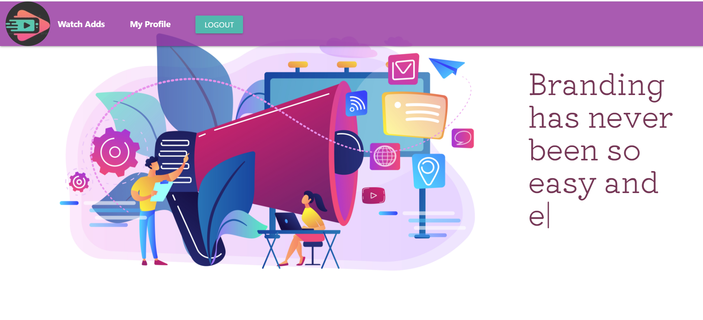
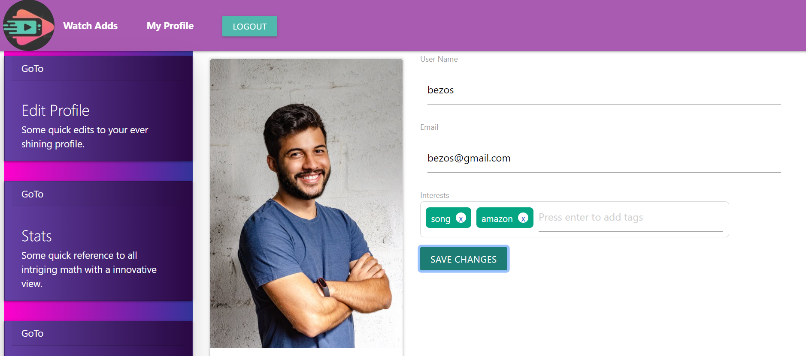
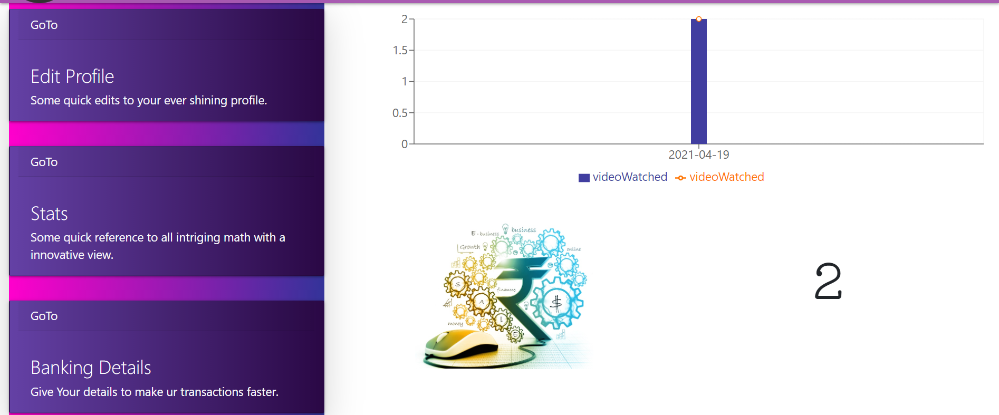
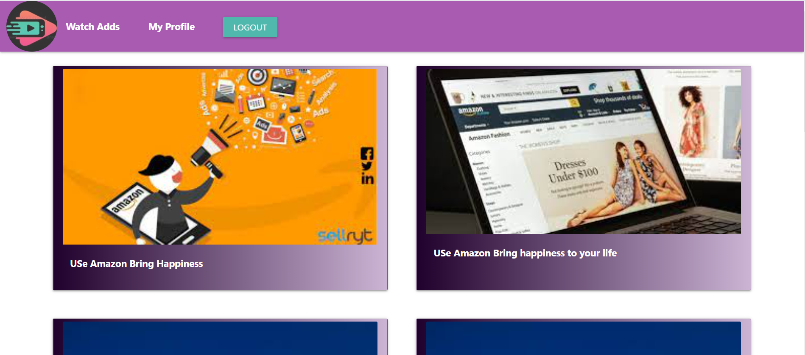
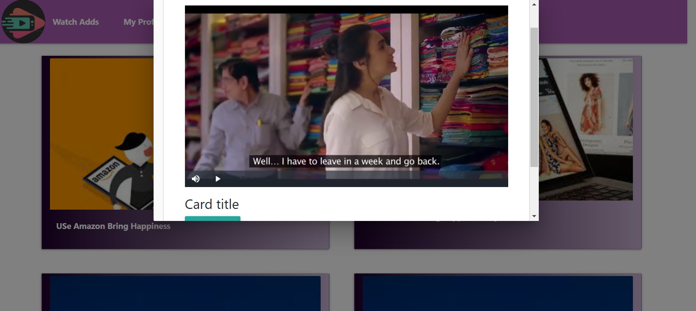
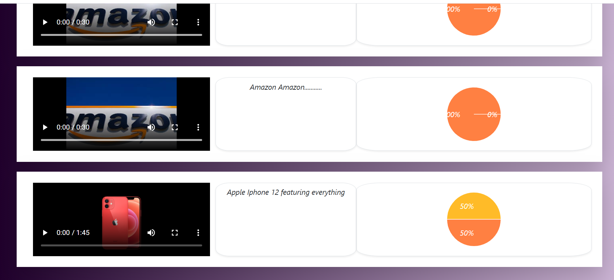
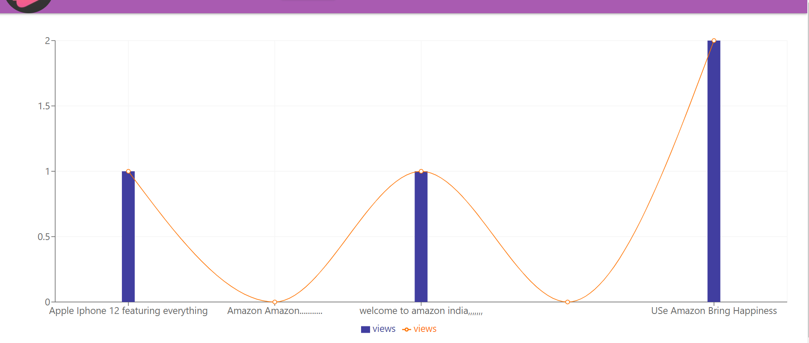

## ✨Readme
<h1 align="center">
  <br>
  <a href="http://www.amitmerchant.com/electron-markdownify"></a>
</h1>

 


AddsTube is a website built to encourage the prime motive of creating  a win  win situation for both the client and the user . Company has always been in search for a optimal solution for publicity of their products . Adds being an easy and efficient way for publicity has been the prime method of spreading the brand name and value . We the forever knights from the 'null void' are here to aid to this situation .   


The respective benefits for the company and clients are as follows ...
   1. Company : 
            1. Branding has never been so easy and efficient.<br />
            2. Fixed amout of complete views are delivered promising further engagement by the user. <br />
            3. Far reaching audience ranging over all the target audience expected.<br />
            4. Easy to get reach to audience and get our youtube channels,companies to reach to the end user. <br />
   2. User/Client: 
            1. Easy way to earn fortune at the cost of your free time.<br />
            2. Easy to monitor the stats of viewerhip over last week<br />
            3. Easy to withdraw fortune earned on weekly basis<br />
            


## ✨Motivation
When you’re a marketing professional, it’s expected that you’ll constantly be generating innovative ideas for showcasing your brand to the world. While problem solving is at the core of what you do, even the most imaginative person needs a little inspiration from time to time.So here we are presenting our product where branding and addvertisement will not be a crap for users.Instead they will come here to incash their leisure time.On the other hand companies will reach directly to  millions of people.not  by disturbing them when they are working. but when they are happy to watch the adds.


## :sparkles:Screen shots of website
   1. <b>Landing Page  of website</b><br /><br />
   
   2. <b>Edit Profile Page of User/Client</b><br /><br />
    
   3. <b>Stats of User which includes last 7 date wise adds watched and credits earned.</b><br /><br />
    
   4  <b>User Side Page for watching adds of the interest selected by user</b><br /><br />
   
   5. <b>Modal opened when user starts watching add.They will not be able to skip add. and credit will only be added when add is fully watched</b><br /><br />
    
   6. <b>Company side adds analysis page which includes adds stats and their views.</b><br /><br />
    
   7. <b>Adds analysis via charts on company side</b><br /><br />


## ✨Tech/framework used
The following tools were used in building this site
* Front-end development
  * HTML
  * CSS
  * BootStrap 
  * Reactjs
  * react-redux
  * materialize-css
  
  
* Back-end development
  * Javascript
  * Node.js
  * Express.js
  * jQuery
  
  
* Database used
  * mongodb
  
* Authorisation/Authentication
  * Jwt Token 
  

* Graph
  * recharts

* Video
  * Video-react
  
 
* Animation 
  * AOS
    

## ✨Features
* **AddsTube:client(POV)**
  * Easy to use interface just a right balance of elegance and simplicity.
  * A novel idea which can change the way we look up to adds.
  * Proper and beautiful representation visualisation of current fortune.
  * Easy to keep track of viewed adds over a week
  * Beautiful UI and animation to please the sight
  * View adds on the basis of your interest
  
 
 
* **AddsTube:company(POV)**
  * A wide range of audience for your product
  * A well tailored UI to match your needs
  * Extremely simple to add advertisement.
  * Easy maintenance of adds data 
  * Easy to check the viewership of an add
  * An easy portal to keep your adds reaching the masses
  
 

* Authentication
  * Secure Authentication features implemented with JWT
  * No two usernames can be same.
  * No two adds/users/company can have same ids
  * User cannot use the features of our site without being logged in.
 
* Additional features
  * Well sanitized code base and easy to maintain
  * All RESTful routes followed and proper routes maintained.
  * Responsive website, suitable for desktop and mobile use. 
 
 


## ✨Installation
It is very easy to use our project if anyone wants. Just follow the steps :

1. Firstly if you are working locally then you need to install the following :
    * Node.js
    * MongoDB
    * VS Code ( recommended , Any other suitable code editor will work )
  
2. Next you need to clone our project's GitHub repository to your desktop 

3. Open command line navigate to the project folder. Then type the following commands to install required dependencies :
     ```javascript
      npm install --save
     ```
4. Your package.json should look like this with the following dependencies
     ```javascript : backend
      "dependencies": {
    "bcryptjs": "^2.4.3",
    "concurrently": "^6.0.0",
    "cors": "^2.8.5",
    "express": "^4.17.1",
    "jsonwebtoken": "^8.5.1",
    "mongoose": "^5.12.2",
    "node-windows": "^1.0.0-beta.5",
    "nodemailer": "^6.5.0",
    "nodemon": "^2.0.7",

   ``` 
   ```javascript : frontend
       "dependencies": {
    "@testing-library/jest-dom": "^5.11.9",
    "@testing-library/react": "^11.2.5",
    "@testing-library/user-event": "^12.8.3",
    "axios": "^0.21.1",
    "bootstrap": "^4.6.0",
    "history": "^5.0.0",
    "install": "^0.13.0",
    "jquery": "^3.6.0",
    "materialize-css": "^1.0.0-rc.2",
    "npm": "^7.9.0",
    "react": "^17.0.1",
    "react-alice-carousel": "^2.4.0",
    "react-bootstrap": "^1.5.2",
    "react-dom": "^17.0.1",
    "react-modal": "^3.12.1",
    "react-parallax": "^3.2.1",
    "react-redux": "^7.2.3",
    "react-router-dom": "^5.2.0",
    "react-scripts": "4.0.3",
    "react-spring": "^9.1.1",
    "react-tagsinput": "^3.19.0",
    "react-toast": "^1.0.1",
    "react-toastify": "^7.0.3",
    "react-typed": "^1.2.0",
    "reactstrap": "^8.9.0",
    "recharts": "^2.0.9",
    "redux-thunk": "^2.3.0",
    "typed.js": "^2.0.12",
    "video-react": "^0.14.1",

   ```
      

5. After successful installation run the following command to start the application :
      ```javascript:frontend (in client folder)
       npm run start
      ```
      ```javascript:backend (in server folder)
      nodemon server.js
      ```


## ✨Challenges we ran into

1. **Finding a unique/novel idea:** Finding a novel and innovative idea for a hackathon has always been a tough job . Developing an idea into a project is the next hell . We made our way through brain storming hours to land where we are right now.

2. **Choosing the right library:** There are huge number of libraries to get any job done . Finding the one suitable to your coding style and motive is a difficult task . We went through some awesome libraries to figure out what is best for the application on the basis of performance and being robust.

3. **Tricky State Management:**  Managing state throughout a huge application considering the local state , global state and function calls has been a challenge. We invested a huge amount of time figuring out how to make it work properly and efficiently.


4. **Interchange of data in MongoDB :**  Interchanging data through the UI and database simultaneously for the user as well as for the company at the same time was a difficult task. We ran into a call back hell and dealt it with some new methods to tackle the same.

5. **Using authentication feature :** This was one of the most important features of our adds project. We had to ensure no two users can have same username, each profile is identified by a unique id, users cannot see adds without logging in and so on.  For this we used  jwt token which provides simple, unobstructive authentication for Node.js. 

7. **Non-availability of members at one location :** Due to current Covid-19 crisis our team was working on this project from three different locations. This was quite difficult in many occasions but still we coordinated well with each other. We were constantly in touch with each other over phone and updated the developments of our project on GitHub via  live share.


## :sparkles:Contribute
 Although we have tried our best to make our application robust and secure, errors might have crept in. If you have any ideas, just [open an issue](https://github.com/nikhilgupta2001/Forever_Knights) and tell us what you think.

If you'd like to contribute, please fork the repository and make changes as you'd like. Pull requests are warmly welcome.

  1. Fork it (https://github.com/nikhilgupta2001/Forever_Knights)
  2. Create your own branch (git checkout -b views/issue)
  3. Commit your changes (git commit -am 'Added new auth feature')
  4. Push to the branch (git push origin views/issue)
  5. Create a new Pull Request


## :sparkles:Credits
   * Special thanks to  <a href="https://github.com/C2OO13">Smith Patel Sir</a> for guiding us throughout the project . Helping us through our doubts and ideological conflicts. 


## :triangular_flag_on_post: Contributors 
  <div>   
  <p>
    💻 <a href="https://github.com/mrSidSa">Siddhesh Sathe</a><br/>
    💻 <a href="https://github.com/nikhilgupta2001">Nikhil Gupta</a><br/>
    💻 <a href="https://github.com/SARVESHKHANDELWAL">Sarvesh Khandelwal</a><br/>
   <p> 
   </div>

## 💻 <a href="https://www.youtube.com/watch?v=GlskH7SKUUM">Demo Video</a><br/>

## :triangular_flag_on_post: Developed by : ⚡️ForeverKnights⚡️
